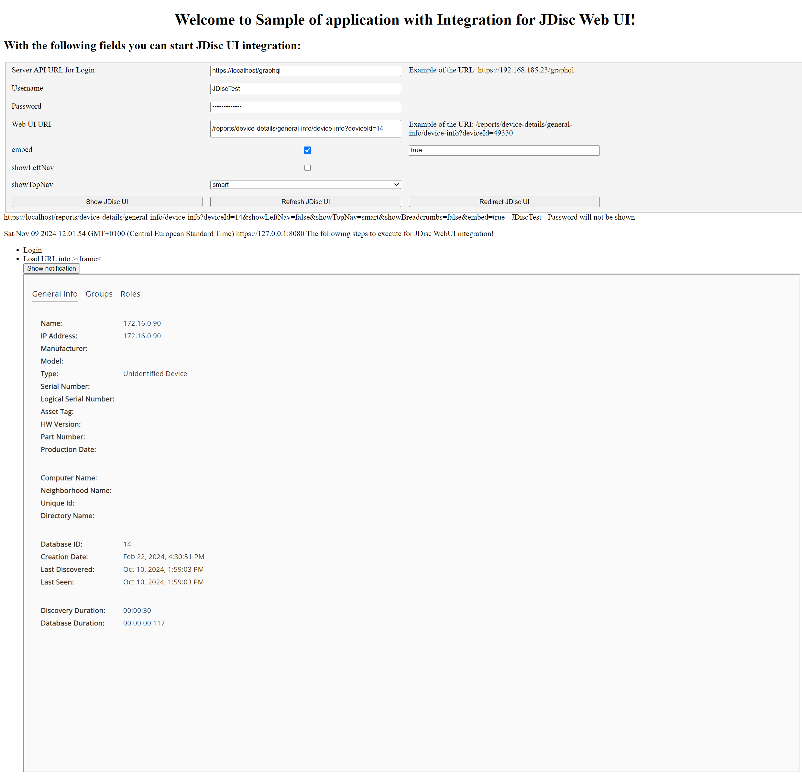

# Sample of the JDisc Web UI integration into third-party Web applications

## Introduction

JDisc provides a GraphQL API for fetching, managing, and controlling discovery data and jobs.
This is the best option for integrating with automation scripts and applications. But sometimes, it could be simpler just to display data as they are presented by JDisc's Web interface.
In this case, you would get new fields/layouts/themes in your application immediately after updating JDisc to a newer version.


### General requirements for Web UI integration
Web UI integration is possible through embedding IFrame.

There are the following requirements to fulfill:
- Secure JDisc Web UI access using a trusted certificate and CORS policy.
- Implement JDisc Web UI integration workflow.

## Secure JDisc Web UI
### Install trusted certificates
Client-side browsers need to recognize the JDisc Web UI site as safe.
This is done by installing a certificate signed by a trusted certificate authority (CA).
The CA can be any well-known trusted CA or enterprise CA.

Installation can be done manually via Web UI or automatically using GraphQL API.

### CORS policies
Antivirus or Firewall software might sometimes restrict loading resources for embedding iframes with scripts.
Also, we have an example of configuring the integrating application's CORS policy.

## JDisc Web UI integration workflow
### Configure user for integration
It is recommended that a dedicated user be registered with minimal access rights in JDisc.
Using the same user for Web UI access and integration is technically possible but highly not recommended.

### Implement integration workflow
Workflow consists of the following steps:

1. Login via GraphQL API.
2. Build URLs for accessing reports. You may copy URL from Web UI and adjust embedding parameters:
```
embed=true|<any vendor id>
showLeftNav=true|false
showTopNav=always|smart|never
showBreadcrumbs=true|false
```
3. Add iframe to your HTML markup and load URLs.
4. Log out via GraphQL API once closing the embedded view.

#### Parameters description

`embed` if set to any value a special layer for reporting presentation will be used. 
The embedding report layer has no main menu, but has left navigation menu for device details unless `showLeftNav` is specified on URL.

`showLeftNav` indicates if left navigation should be displayed. This parameter overrides default behavior of left navigation menu when running with `embed`. 
Additionally, `showLeftNav` specifies visibility of left navigation menu when running without `embed`.  

`showTopNav` indicates how top navigation menu should be displayed. If `always` the navigation menu on top of the page is displayed (default behavior if run without `embed`),
if `smart` then navigation menu appears under device details only (default behavior if run with `embed`), and if `never` then top navigation does not appear.

`showBreadcrumbs` is used to hide breadcrumbs when running without `embed` and `showTopNav` is set to `always`

